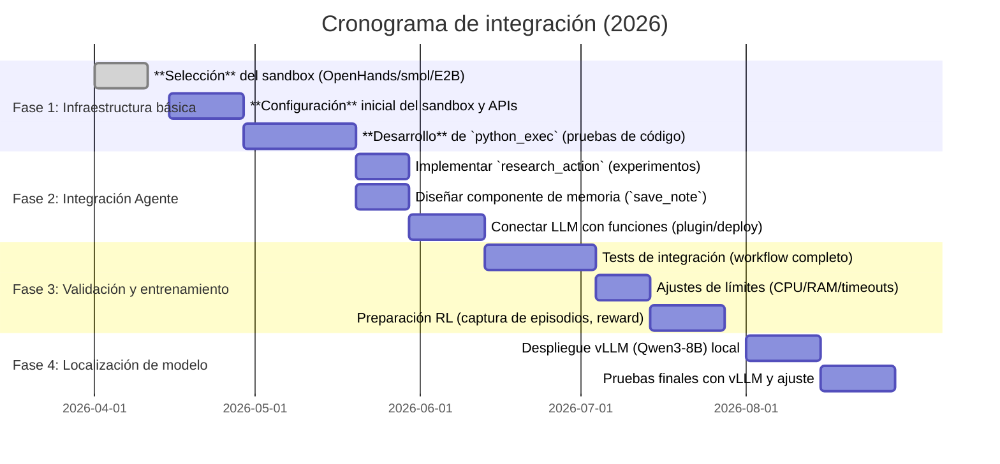
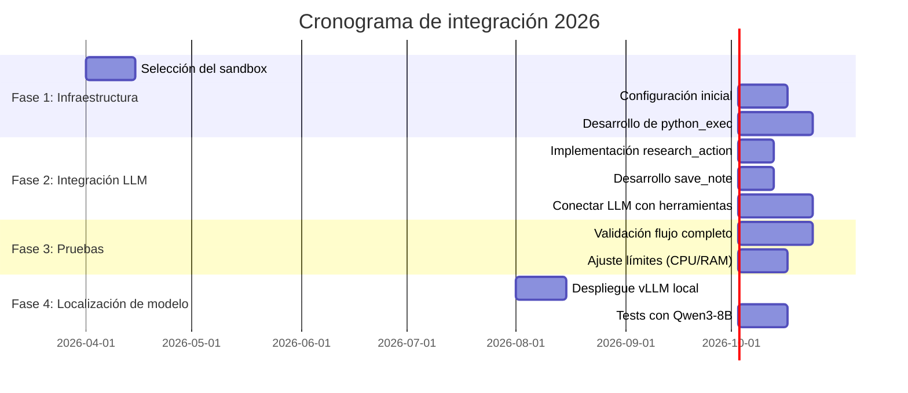

# Resumen Ejecutivo 

En este informe analizamos soluciones de código abierto para habilitar un agente LLM que ejecute Python de forma segura y persistente en SREG. Identificamos varios proyectos clave (p.ej. **OpenHands**, **smolagents**, **E2B**, **SandboxFusion**, **AIO Sandbox**, etc.) y comparamos sus características respecto a los requisitos de SREG. Cada proyecto ofrece un esquema de *sandboxing* distinto (contenedores Docker, microVMs Firecracker, WASM/Pyodide, etc.), con diferentes niveles de aislamiento y persistencia. También revisamos patrones de diseño para un bucle iterativo “datos→código→resultados→razonamiento→acción” (por ejemplo, el patrón **ReAct**【46†L1-L4】 y el uso de *scratchpads*【43†L50-L58】 para gestionar estado). 

Nuestra recomendación final es usar **OpenHands** como base (por su madurez, modelo-agnosticismo y runtime seguro en contenedores【47†L179-L187】【47†L198-L201】), complementado quizás con **smolagents** o **E2B** para la ejecución de código. OpenHands destaca por ser de código abierto (MIT) y diseñarse para agentes codificadores en ambientes aislados. Como segunda opción consideraríamos smolagents (ligero, Apache-2.0, soporta múltiples sandboxes【3†L308-L314】) o E2B (microVM Firecracker robusto【29†L342-L350】, si se tolera su infraestructura). Además, diseñamos una arquitectura propuesta con APIs de herramienta estándar (p.ej. `python_exec`, `research_action`, `save_note`, `submit`) y establecimos límites de seguridad (CPU/memoria, imports restringidos, aislamiento de red). 

A continuación se detalla el inventario de proyectos, su evaluación y comparativa, alternativas de sandbox, patrones de flujo de trabajo, propuesta de integración y recomendaciones finales.  	

## 1. Inventario de proyectos open source relevantes  

- **OpenHands** (GitHub: *OpenHands/OpenHands*): Plataforma de agentes para desarrollo de software. Licencia MIT (núcleo y “agent-server” son MIT【16†L476-L480】). Lenguajes: Python (backend) y TypeScript (frontend). Ofrece un SDK y runtime en contenedores Docker/Kubernetes con acceso controlado【47†L179-L187】【47†L198-L201】. Modelo-agnóstico (adaptable a cualquier LLM)【47†L179-L187】. Madurez: alto (≈65k★ en GitHub【47†L308-L315】), comunidad activa. Persistencia: sí (el entorno de agentes es de larga duración). Herramientas: propio sistema de *tool-calling* modelo-agnóstico, con integración CLI/SDK. Arquitectura: agente servidor orquestador + microagentes.  

- **smolagents** (GitHub: *huggingface/smolagents*): Librería Python ligera (≈25k★). Licencia Apache-2.0. Soporta ejecución de agentes “pensando en código”: su API permite que el agente genere acciones en forma de código ejecutable. Integra varios backends de sandbox (contenedor Docker, microVM E2B, Blaxel, Pyodide, Modal)【3†L308-L314】. Modelo-agnóstico (cualquier modelo compatible con el flujo de mensajes + tool calls)【3†L317-L320】. Persistencia: si se configura un contenedor duradero, mantiene estado entre llamadas (por ejemplo usando E2B o Blaxel). Control de imports y límites: depende del sandbox elegido. Arquitectura: core Python, sin interfaz visual. Estado del proyecto: muy activo (miles de forks y commits).  

- **Open Interpreter** (GitHub: *openinterpreter/open-interpreter*): Interfaz conversacional local (≈63k★). Licencia AGPL-3.0 (estricta). Permite al LLM ejecutar código Python, JS, Shell, etc., en la máquina local【56†L292-L300】. Herramienta CLI/SDK; mantiene la conversación en memoria (persistencia de “mensaje” en el chat【56†L292-L300】). No es un servidor aislado: ejecuta código sobre el sistema anfitrión (requiere confirmación del usuario por seguridad). Ventaja: sin límites de tiempo ni bibliotecas, con internet【56†L365-L370】. Desventaja: código se ejecuta con plena capacidad local (pocos controles), licencia restrictiva.  

- **PandasAI** (GitHub: *sinaptik-ai/pandas-ai*): Biblioteca Python (≈1.4k commits). Licencia MIT【48†L41-L45】 (versión comunitaria). Permite hacer preguntas en lenguaje natural a DataFrames usando un LLM subyacente【20†L329-L338】. Está orientado a preguntas puntuales sobre datos (QA), no es un “harness” de agente. Modelo-agnóstico. No gestiona estados multi-turn completos (cada consulta es independiente). No ofrece aislamiento de código (solo genera consultas SQL/Pandas).  

- **Terrarium (Pyodide)** (GitHub: *cohere-ai/cohere-terrarium*): Sandbox Python basado en Pyodide (WASM en Node.js). Licencia MIT. Diseñado para ser rápido y económico en Google Cloud【31†L271-L279】. **Sin estado persistente**: “el sandbox se recicla completamente después de cada invocación; no se mantiene ningún estado”【31†L279-L288】. Pro: arranque rápido, incluye bibliotecas comunes (NumPy, pandas, matplotlib)【31†L287-L288】. Con: ejecución aislada en WASM (sin acceso a FS real ni red), ideal para tareas cortas.  

- **SkyPilot Code Sandbox** (GitHub: *alex000kim/skypilot-code-sandbox*): Demo de sandbox seguro en la nube. Licencia Apache-2.0. Construido sobre **llm-sandbox**, ofrece ejecución multi-idioma escalable【26†L252-L261】. Incluye colaboración (montaje S3), autenticación token, y Docker como sandbox【26†L258-L266】. Muy pocas estrellas (16★); es más demo que producción. Puede servir de ejemplo de integración MCP (Modelo Context Protocol).  

- **E2B** (GitHub: *e2b-dev/E2B*): Plataforma completa para ejecutar código AI en la nube. Licencia Apache-2.0【29†L434-L438】. Usa microVMs Firecracker de AWS para aislamiento fuerte【29†L342-L350】. SDK Python/TypeScript para controlar sandboxes【29†L342-L350】. Facilidad: rápido (arranque ~150ms), aislamiento a nivel de kernel【36†L90-L99】. Limitación: depende del servicio E2B, 24h sesión máxima【36†L103-L112】, sin GPUs. Modelo-agnóstico (cualquier modelo emite llamadas a SDK).  

- **SandboxFusion** (GitHub: *bytedance/SandboxFusion*): Sandbox multi-lenguaje para correr y evaluar código de LLMs. Licencia Apache-2.0【51†L424-L432】. Soporta muchos lenguajes (incluido Python con GPU)【51†L299-L307】 y kernels Jupyter. Originalmente enfocado a benchmarks (HumanEval, MBPP)【51†L325-L334】. Usa Docker internamente; proporciona ejecución y evaluación de código, pero típicamente estateless. Estado del proyecto: activo (≈123 commits). Es adecuado para *runner* de código pero no mantiene contexto histórico.  

- **AIO Sandbox** (GitHub: *agent-infra/sandbox*): Entorno “todo en uno” basado en Docker. Licencia Apache-2.0. Ofrece interfaz web (VSCode, Jupyter, terminal) y una API para ejecutar código Python/Node en un sandbox seguro【18†L341-L349】【18†L356-L364】. Proporciona sistema de archivos unificado virtual y ACLs de seguridad. Persistencia: el contenedor puede durar todo el episodio. Orientado a trabajo en equipo (colaboración). Repositorio activo (v1.0 lanzado).  

Cada uno de estos proyectos tiene una arquitectura diferente (contenedores, microVM, WASM) y distintas capacidades de persistencia. En la **Tabla Comparativa** (sección siguiente) resumimos su compatibilidad con los requisitos SREG: tipo de aislamiento, persistencia de sesión, modelo de memoria, compatibilidad con tool-calling OpenAI-API, etc.  

## 2. Evaluación honesta (Pros/Contras para SREG)  

Para cada proyecto destacado analizamos sus puntos fuertes y limitaciones en el contexto SREG:

- **OpenHands**: *Pros:* Muy maduro y robusto, con amplio ecosistema open-source【47†L308-L315】. Ofrece aislamiento en Docker/K8s bajo control del equipo, y un runtime de agentes preconfigurado【47†L198-L201】. Es modelo-agnóstico y soporta integración por tool-calling y APIs (SDK/CLI). Mantiene estado de agentes entre tareas (persistencia). *Contras:* Complejidad y peso: es una plataforma amplia más orientada a flujos de trabajo de ingeniería que a simple análisis de datos. Requiere contenedores y configuraciones Kubernetes (aunque permiten uso on-premise). Puede ser sobredimensionado si solo se necesita análisis de tablas pequeñas.  

- **smolagents**: *Pros:* Diseño minimalista y flexible. Permite conectar cualquier LLM con múltiples entornos de ejecución (incl. Docker, E2B, Pyodide)【3†L308-L314】. Es modelo-agnóstico (LiteLLM)【3†L317-L320】. Permite escribir las acciones en código Python directamente, facilitando edición y depuración. La persistencia de estado depende del backend (por ejemplo, usando E2B puede tener sandbox de larga duración). Ligero y fácil de desplegar en Python 3.11. *Contras:* No ofrece por sí mismo un mecanismo de memoria estructurada: el historial debe gestionarse externamente. No hay control incorporado de imports (depende del sandbox subyacente). Aun siendo completo, carece de muchas funcionalidades “de serie” (p.ej. almacenamiento de notas, logging) que sí brindan otros frameworks mayores.  

- **Open Interpreter**: *Pros:* Ejecuta código en el entorno local sin restricciones de paquetes ni tiempo【56†L365-L370】, haciendo uso total de librerías Python. Mantiene la conversación en memoria (permite varios turnos, guardar mensajes)【56†L292-L300】. Se integra fácilmente en notebooks o CLI. *Contras:* Al ejecutarse en el sistema local, solo está protegido por confirmación manual del usuario (no es un sandbox seguro aislado). No puede restringir imports ni CPU/memoria. Licencia AGPL-3.0 puede ser un impedimento (obliga a abrir cualquier derivado). No está diseñado específicamente para entornos experimentales de ciencia; más bien para tareas locales generales.  

- **PandasAI**: *Pros:* Permite consultas avanzadas sobre datos tabulares usando LLMs con RAG. Sencillo de usar para preguntas ad-hoc. *Contras:* No es un “harness” de agente interactivo; cada consulta es independiente y no hay un bucle de razonamiento multi-turno. No ofrece sandbox ni herramientas (todo el procesamiento ocurre localmente en Python). Por tanto, no cumple con la mayoría de requisitos de SREG (persistencia, tool-calling, control de estado).  

- **Terrarium (Pyodide)**: *Pros:* Aislamiento muy fuerte (WASM sin acceso nativo a filesystem o red)【31†L317-L325】. Latencia baja y ejecución económica en la nube【31†L271-L279】. Soporta pandas, NumPy, etc. *Contras:* **No persistencia de estado:** “cada sandbox se recicla completamente después de cada invocación, no se mantiene ningún estado”【31†L279-L288】. Esto impide llevar memoria interna entre turnos. El stack de Pyodide limita la interactividad (no hay multihilo, sin procesos externos). Adecuado solo para tareas puntuales aisladas, no para flujos iterativos.  

- **SkyPilot Code Sandbox**: *Pros:* Diseñado para ser auto-desplegable en cualquier nube (multi-cloud). Ofrece autenticación por token, mount S3, aislamiento en Docker【26†L258-L266】. Permite integración MCP (alejado del proveedor). *Contras:* Es un proyecto demo muy incipiente (solo unos commits). Falta documentación consolidada. Su uso real requiere SkyPilot (influencia comercial).  

- **E2B**: *Pros:* Plataforma enfocada en agentes. Ejecuta código en microVMs Firecracker con arranque ultra-rápido (≈150ms)【36†L90-L99】 y aislamiento a nivel kernel【36†L90-L99】. SDK bien documentado permite iniciar sandboxes, ejecutar múltiples líneas, tomar salidas. Permite mantener estado dentro de la sandbox hasta 24h (persistencia moderada). *Contras:* Sin GPUs, depende de la infraestructura de E2B (aunque permiten self-host con Terraform). Plan gratuito limitado; planes de pago a partir de costo por uso. Límite de 24h de sesión requiere checkpointing manual. No expone directamente tool-calling al estilo OpenAI; el modelo debe generar llamadas al SDK.  

- **SandboxFusion**: *Pros:* Muy completo en lenguajes soportados (Python con GPU incluido)【51†L299-L307】. Diseñado para evaluar código con tests (ideal para verificación automática). *Contras:* Pensado para evaluaciones aisladas; su flujo no incluye persistencia ni memoria de largo plazo. Cada ejecución es nueva (sin historial). Ofrece CLI/API para ejecutar código, pero no una integración “tool-calling” nativa para LLM (se podría adaptar). Menos orientado a análisis de datos, más a retos de programación.  

- **AIO Sandbox**: *Pros:* Entorno unificado y amigable, con múltiples interfaces (VSCode, Jupyter, shell) en un único contenedor【18†L341-L349】. API Python para ejecución de código aislado. Contiene protección de filesystem virtual y seguridad entre usuarios. Permite montar volúmenes compartidos. Persistencia: el entorno persiste mientras dure la sesión, por lo que el estado del contenedor se mantiene. *Contras:* relativamente nuevo, menos probado en producción que OpenHands. Requiere despliegue en Docker (puede ser sencillo, pero es infraestructura extra). Menor enfoque explícito en soporte multi-turn/memoria.  

- **LangChain / Otros frameworks**: Si bien LangChain y similares (p.ej. Agents de Microsoft, AutoGen) son populares, **no los consideramos proyectos aislados de “ejecución de código”.** LangChain es una biblioteca para orquestar LLMs con herramientas, pero **no proporciona por sí misma un sandbox seguro**. Requeriría combinarlo con contenedores o Pyodide para aislar el código. Tampoco implementa por defecto memoria persistente (más allá de vectores RAG). En resumen, LangChain es útil como motor de flujo, pero no cumple directamente con los requisitos de seguridad y persistencia sin soporte adicional.

En resumen, **los proyectos más completos para SREG** parecen ser OpenHands (runtime seguro y persistente, aunque complejo) y smolagents (flexible y ligero). E2B es muy sólido para ejecución aislada, pero es más un servicio que un framework empaquetado y requiere infraestructura. Terrarium sobresale en seguridad (WASM) pero falla en persistencia. AIO Sandbox es prometedor como contenedor auto-contenido. Cada opción tendrá que adaptarse (p.ej. combinando smolagents con un sandbox concreto, o integrando OpenHands con procesos de Python internos).  

## 3. Comparativa tabular de soluciones

| Proyecto         | Persistencia de sesión | Tipo de sandbox       | Modelo de memoria  | Tool-calling OAI-compatible | Listo para RL | Madurez (act., uso) | Recomendado SREG |
|------------------|------------------------|-----------------------|--------------------|-----------------------------|---------------|---------------------|------------------|
| **OpenHands**    | Sí (persistente cont.) | Docker/K8s            | Ext. (BD, logs)    | Sí (SDK/API propio)          | Sí            | Alta (65k★)        | ★★ (Mejor)       |
| **smolagents**   | Sí (según backend)     | E2B/Blaxel/Pyodide/Docker【3†L308-L314】 | Internal (conversación) | Parcial (scripts en Markdown) | Medio        | Alta (25k★)        | ★ (Alternativa)  |
| **OpenInterpreter** | Sí (chat-Memoria)    | Sistema local         | Interna (mensaje)  | No (chat independiente)      | No            | Media (62k★)      | ✗ (No ideal)     |
| **E2B**          | Sí (24h máx)           | Firecracker (microVM)【36†L90-L99】 | Sandbox-local      | No (usa SDK)                | Medio         | Alta (4.7k commits)| ★ (Cuidadosa)    |
| **SandboxFusion**| No (stateless)         | Docker (contenedor)【51†L283-L291】 | – (sin historial)  | Sí (API de ejecución)       | No            | Media (0.1k★)     | ✗ (Limitado)     |
| **AIO Sandbox**  | Sí (contenedor cte)    | Docker (contenedor)【18†L341-L349】 | Ext. (volúmenes)   | Sí (MCP Server API)         | Medio         | Baja (1.0.0 Beta)  | ★ (Útil)         |
| **Terrarium**    | No (cada call reinicia)| WASM/Pyodide         | –                  | Sí (HTTP REST)              | No            | Baja (307★)       | ✗ (No cumple)    |
| **PandasAI**     | No (solos QA puntual)  | N/A (lib Python)      | N/A                | No (uso directo, no func.)  | No            | Media (1.4k★)     | ✗ (No aplicable) |

- *Persistencia:* Indica si el entorno de ejecución guarda estado entre turnos (por episodio).  
- *Memoria:* Se refiere a cómo almacena el agente la información entre iteraciones (por ejemplo, base de datos externa, historial de chat, archivos temporales).  
- *Tool-calling:* Si se adapta al esquema estándar de funciones de OpenAI (mensajes JSON). En general, todos son *model-agnostic*, pero no todos implementan directamente `python_exec(...)`. OpenHands y AIO exponen APIs que pueden adaptarse; otros requieren adaptaciones.
- *Ready for RL:* Capacidad de integrarse en bucles de entrenamiento. OpenHands y smolagents soportan seguimiento de episodios (útiles para RL). Herramientas como OpenInterpreter no fueron diseñadas para RL.  
- *Madura:* Basado en actividad, estrellas y uso real.  

Esta comparativa sugiere que **OpenHands** es la opción más completa (★ mejor para SREG): ofrece ejecución aislada en contenedores, persistencia de sesiones y arquitectura pensada para agentes de desarrollo. Como segunda opción (**smolagents**★): es flexible y simple, pudiendo acoplarse a distintos sandboxes (incluso a E2B o AIO) para análisis de datos. En tercer lugar, **E2B** es muy seguro pero depende de infraestructura externa (entrega SaaS). Tools como SandboxFusion o Terrarium son especializados pero no cumplen los requisitos de persistencia. 

## 4. Alternativas de ejecución y ejemplos open source

Existen varias estrategias para permitir que un agente ejecute código de forma segura:

- **Pyodide / WASM (Terrarium)**: Ejecuta Python dentro de WebAssembly. Ejemplo: *Terrarium*【31†L271-L279】. *Pros:* Muy alto aislamiento (no acceso al sistema), bajo costo. *Contras:* Sin persistencia de estado【31†L279-L288】, limitaciones de red/FS. Útil para análisis puntuales rápidos.  
- **MicroVMs (Firecracker, gVisor)**: Ejecución en microVMs ligeras. Ejemplo: *E2B* usa Firecracker【36†L90-L99】. *Pros:* Aislamiento a nivel kernel (seguridad fuerte), rápido arranque (≈150ms)【36†L90-L99】. *Contras:* En la mayoría de soluciones (Vercel Sandbox, E2B, Cloudflare) hay límites de tiempo. Requiere infra especializada. Open source: E2B (público), Beam Cloud (docker-based).  
- **Contenedores Docker**: Aislamiento por contenedores. Ejemplo: *SandboxFusion*【51†L283-L291】, *AIO Sandbox*【18†L341-L349】. *Pros:* Fácil de desplegar (cualquier Docker host), imágenes estándar. *Contras:* Aislamiento menos fuerte que microVM; si mal configurado, puede escaparse. Se debe montar filesystem virtual para cada agente. Ejemplo OSS: AIO Sandbox (unifica VSCode/Jupyter), proyectos basados en Jupyter Kernel Gateway en Docker (p.ej. JupyterHub) pueden adaptarse.  
- **Herramientas especializadas**: Plataformas cloud que ofrecen execution-as-a-service, p.ej. *E2B* (ya mencionado), *Modal* (cerrado), *Vercel/Sandboxes* (Firecracker). *Pros:* Gestionan escalado y seguridad. *Contras:* Generalmente no son OSS (o son mixtas). Beam Cloud promociona open source similar a E2B (Docker).  
- **Exec local con precauciones**: El agente corre código directamente en la máquina anfitriona mediante APIs del sistema (p.ej. `subprocess`). *Pros:* simple. *Contras:* Muy inseguro (peligro de *escaping* de sandbox, requiere firewall y control de permisos). No recomendado para SREG.  

En la práctica, un enfoque mixto suele ser ideal: por ejemplo, usar un sandbox Docker local controlado (con recursos limitados) junto con mecanismos de memoria externos. OpenHands y AIO combinan Docker con mecanismos de almacenamiento. E2B combina microVMs en la nube con persistencia moderada. No hay una solución perfecta "lista para usar", pero muchos proyectos OSS pueden adaptarse: p.ej. **AIO Sandbox** para entornos colaborativos, **smolagents** + **E2B** para entornos persistentes ligeros, **Terrarium** para pruebas de código seguras sin estado. 

## 5. Patrones de diseño: datos→código→resultados→razonamiento→acción

Para resolver iterativamente un problema de investigación en SREG, se siguen patrones ya identificados en la literatura:

- **ReAct (Reason + Action)**: El agente alterna fases de razonamiento (generando código o hipótesis) con acciones (ejecución de código o experimentos)【46†L1-L4】. Primero “piensa” (añade *chain-of-thought* en su prompt), luego genera una llamada a `python_exec` (acción), analiza la respuesta y repite. Este bucle se repite hasta la solución.  

- **Uso de *scratchpad* o pizarra**: Se mantiene un espacio intermedio donde el agente anota ideas, resultados parciales, gráficos o tablas intermedias【43†L50-L58】. Por ejemplo, después de ejecutar código, el agente guarda los resultados claves en el *scratchpad* (texto o JSON) para no perder contexto. Según Masood et al., los *scratchpads* son “espacios de trabajo intermedios (textuales o estructurados) que los LLM usan para razonar, planificar, llamar herramientas, rastrear estado…”【43†L50-L58】. Esto mejora la coherencia en multi-turnos.  

- **Descomposición y refinar**: Si el agente obtiene un resultado preliminar, lo analiza críticamente y puede lanzar un experimento adicional o reajustar parámetros. P.ej. si calcula una correlación y es baja, podría subdividir el dataset o intentar otra métrica. Esta fase de refinamiento puede implicar usar otro *tool*-call (`python_exec` con código ajustado) o un *research_action* con un experimento.  

- **Verificación con tests**: Siguiendo el espíritu de SandboxFusion, el agente puede generar pruebas unitarias o usar métodos estadísticos para verificar sus hallazgos automáticamente. Por ejemplo, tras inferir una distribución, podría calcular un test estadístico con Python para validar la hipótesis antes de concluir.  

En resumen, el flujo típico es:  
```  
Datos iniciales → (consulta) → Generar código Python → Ejecutarlo (sandbox) → Obtener resultados (estadísticas, gráficas)  
       ↓                                                           ↑  
Almacenaje de hallazgos (scratchpad) ← Razonamiento con la respuesta      Acción siguiente  
```  
Este patrón iterativo (repetir razonamiento-acción hasta convergencia) es clave en agentes de ciencia. **ReAct**【46†L1-L4】 encapsula la idea de intercalar razonamiento con acciones. Mantener un *scratchpad* textualmente (o base de notas estructuradas) ayuda a que el modelo “recuerde” el progreso y detecte incoherencias【43†L50-L58】.  

## 6. Propuesta de integración y arquitectura

Proponemos la siguiente arquitectura general (diagrama abajo) y API de herramientas para el agente SREG:

```mermaid
flowchart TB
  subgraph LLM_Agente
    direction LR
    A[Pregunta/Hipótesis] 
    A -->|tool_call (python_exec)| Exec[Sandbox Python]
    Exec -->|resultado| B[Razonamiento LLM]
    B -->|tool_call (save_note)| Mem[Base de Notas]
    B -->|tool_call (research_action)| Res[Ambiente (Dataset/Experimento)]
    Res -->|observación| B
    B -->|tool_call (submit)| Salida[Respuesta Final]
  end
  subgraph Infraestructura
    Exec -->|código| PythonEnv[Entorno Aislado]
    Mem --> Database[(Base de Hipótesis)]
    Res --> Env[SREG Simulado]
  end
```

- **Herramientas expuestas:** 
  - `python_exec(código: str) → resultado: texto/JSON` – Ejecuta código Python en un sandbox seguro (retorna stdout o datos).  
  - `research_action(action_id: str) → datos/observación` – Realiza una acción de investigación en SREG (por ejemplo, tomar una muestra o intervención definida).  
  - `save_note(texto: str) → ok` – Guarda un comentario, hipótesis o hallazgo en la memoria del agente.  
  - `submit(respuesta: distribución/elección)` – Envía la respuesta final al entorno.  

- **Contratos de seguridad:** El sandbox Python *solo* debe permitir el subconjunto de operaciones estrictamente necesario (p.ej. cálculos y acceso limitado a datos). Se recomiendan: límites de CPU y RAM por ejecución; deshabilitar imports riesgosos; deshabilitar conexión de red externa. Por ejemplo, la arquitectura de SkyPilot Sandbox usa autenticación por token y contenedores aislados【26†L258-L266】. Podríamos copiar esa idea: cada llamada a `python_exec` incluiría un token de sesión, y el código corre en un Docker/K8s cerrado sin acceso a red.  Además, el persistente sandbox del episodio se reciclaría al final.  

- **Persistencia de contexto:** Aunque el sandbox contenedor puede mantenerse vivo, no es suficiente para garantizar memoria a largo plazo. Proponemos almacenar *algunas* notas clave en una base de datos (p.ej. SQLite o JSON simple) accesible con `save_note`. La conversación completa (prompt) en sí se mantiene vía el estándar de tool-calling (OpenAI) entre turnos. Para no saturar tokens, se puede resumir o archivar mensajes antiguos externamente (similar a un *scratchpad* estructurado).  

- **Integración con LLM:** El agente comunicará con el modelo usando *function calling* estándar (OpenAI-compatible). Las llamadas de tipo `tool_call` en el JSON del modelo se mapearán a nuestras herramientas Python. Esta arquitectura es *agnóstica* al proveedor: funciona igual con GPT-4o en Azure o con Qwen3/vLLM local.  De hecho, el ejemplo de SkyPilot muestra que con un simple MCP server (basado en FastAPI) podemos conectar cualquier cliente (Claude Desktop, VSCode, etc.)【26†L278-L287】. Lo importante es que las funciones externas (python_exec, research_action, etc.) respeten el contrato JSON entre turnos.  

- **Migración a vLLM local:** Inicialmente se probaría con GPT-4o mediante Azure (ya compatible con funciones). Para pasar a Qwen3-8B local, usaremos un contenedor con vLLM/SGLang que exponga la misma API de completion. La clave es no usar características propietarias: tanto GPT-4o como Qwen gestionan tool-calls por completo del lado de la aplicación. Solo hay que configurar el endpoint local para `chat_completion`, sin cambiar la lógica de herramientas.  

A continuación, un cronograma tentativo (Mermaid) de integración:  



Cada tarea clave va progresando en paralelo o secuencia. Por ejemplo, simultáneamente se puede configurar el entorno de sandbox y empezar a desarrollar el parsing de llamadas. La validación incluye probar casos reales de SREG y la transición a modelos locales.  

## 7. Recomendaciones finales 

En base al análisis, recomendamos iniciar con:

1. **OpenHands** – Su robustez, uso amplio y arquitectura segura lo convierten en la mejor opción “todo en uno”【47†L179-L187】【47†L198-L201】. Proporciona ya un harness maduro con soporte de herramientas estándar, control de acceso, y gestión de tareas en contenedores. Aunque requiere inversión en desplegar su infraestructura, su comunidad y documentación compensan esta curva.  

2. **smolagents** – Como segunda opción por su ligereza y flexibilidad. Puede actuar como la “capa de agente” que genera código, aprovechando un backend a elección (p.ej. un sandbox Docker o E2B) para la ejecución real【3†L308-L314】. Esto combina la sencillez de smol (no depende de un gran ecosistema) con la seguridad de un sandbox robusto.  

Si se prefiere un servicio en nube ya configurado y sin preocuparse por contenedores, **E2B** es una opción viable, aunque introduce dependencia externa (y costo)【29†L342-L350】【23†L49-L57】. Para pruebas rápidas sin persistencia, podría usarse *Terrarium*, pero con la advertencia de que no guarda estado entre rondas. También puede combinarse OpenHands con smolagents o E2B (p.ej. usar el SDK de OpenHands para orquestar agentes y dejar que smol genere código).  

**No reinventar la rueda:** hay que usar proyectos OSS ya existentes siempre que sea posible. Ejemplos como los citados pueden adaptarse y extenderse en lugar de construir todo desde cero. Por ejemplo, se podría integrar PandasAI para la parte de queries a tablas dentro del sandbox Python existente, en vez de implementar un motor nuevo. 

Finalmente, enfatizamos la necesidad de iterar sobre el diseño de memoria/contexto: probar estratégías de resumen o memorización de prompts (inspirándose en SWE-Agent【8†L275-L284】 o OpenHands) para que el agente mantenga coherencia en largos diálogos. El uso de metadatos y bases de notas (via `save_note`) será clave para no agotar tokens. En conjunto, la combinación de *OpenHands + smolagents* (o similares) ofrece el balance más prometedor de seguridad, persistencia y flexibilidad.  

## 8. Diagramas Mermaid  

**Arquitectura propuesta:** flujo de interacciones entre el LLM-agente, sandbox de Python y subsistemas de memoria/experimento.  

```mermaid
flowchart LR
  subgraph Agente-LLM
    A[Usuario/Instrucción] 
    A -->|llm_response| LLM[Modelo LLM]
    LLM -->|tool_call: python_exec(código)| Sandbox[Sandbox Python]
    Sandbox -->|salida| LLM
    LLM -->|tool_call: research_action(acción)| Env[SREG Sim]
    Env -->|observación| LLM
    LLM -->|tool_call: save_note(texto)| Mem[Notas Locales]
    LLM -->|tool_call: submit(respuesta)| Sal[Respuesta Final]
  end
  subgraph Infraestructura
    Sandbox -->|corre| PythonEnv[Contenedor Aislado]
    Env -.->|data| Dataset[[Dataset Tabular]]
    Mem -->|guarda en| DB[(Base de Notas / SQLite)]
  end
  classDef proceso fill:#f9f,stroke:#333,stroke-width:1px;
  class A,LLM,Sandbox,Env,Mem,PythonEnv proceso;
```

**Cronograma de integración (Gantt):** (ver sección anterior para explicación detallada de las fases.)  



## 9. Referencias clave 

- **smolagents – HuggingFace:** *smolagents: a barebones library for agents that think in code*【3†L308-L314】【3†L317-L320】 (repositorio GitHub, Apache-2.0).  
- **OpenHands – All-Hands:** Página oficial *OpenHands: The Open Platform for Cloud Coding Agents*【47†L179-L187】【47†L198-L201】. Repositorio GitHub (*OpenHands/OpenHands*)【16†L476-L480】 (MIT).  
- **Open Interpreter:** *Open Interpreter* GitHub【56†L292-L300】【56†L365-L370】 (AGPL-3.0, Python CLI).  
- **PandasAI:** *PandasAI* GitHub【20†L329-L338】【48†L41-L45】 (MIT, Python library Q&A con LLM).  
- **Terrarium:** *cohere-ai/terrarium* GitHub【31†L271-L279】【31†L279-L288】 (sandbox Pyodide, MIT).  
- **SkyPilot Code Sandbox:** *alex000kim/skypilot-code-sandbox* GitHub【26†L252-L261】【26†L258-L266】 (Docker + MCP sandbox).  
- **E2B – Enterprise Agent Cloud:** *e2b-dev/E2B* GitHub【29†L342-L350】【29†L434-L438】 (Apache-2.0, SDK Python/TypeScript).  
- **SandboxFusion:** *bytedance/SandboxFusion* GitHub【51†L283-L291】【51†L299-L307】 (Apache-2.0, multi-language code runner).  
- **AIO Sandbox (agent-infra):** GitHub *agent-infra/sandbox*【18†L341-L349】【18†L356-L364】 (Apache-2.0, VSCode/Jupyter en Docker).  
- **Skypilot Blog:** Alex Kim, *“Self-host open-source LLM agent sandbox on your own cloud”*【23†L49-L57】 (discusión de E2B, costos y microVMs).  
- **Patrones de agentes LLM:** Adnan Masood, *“LM Agents con Scratchpads y Verifiers”* (Medium, 2026)【43†L50-L58】; Michael Lanham, *“10 LLM Agent Patterns (ReAct) * (Medium, 2025)【46†L1-L4】.  

Cada fuente anterior proporciona detalles técnicos y conclusiones que respaldan las evaluaciones aquí presentadas.