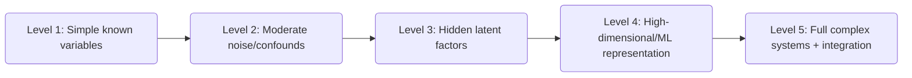

# Executive Summary  
Science has always sought reliable knowledge through observation and reasoning.  Classical methods (from Aristotle and Bacon to Newton and Popper) emphasized inductive experiments and explicit hypotheses【10†L230-L238】【57†L335-L344】.  In the 20th century, philosophers like Popper and Kuhn revealed science is “risky” and paradigm-bound【59†L37-L40】【58†L13-L20】.  Today, however, massive datasets and AI are transforming research.  New tools (deep learning, foundation models, self-driving laboratories) enable **data-driven** and often “black‑box” discovery, complementing but also challenging traditional hypothesis-driven inquiry【23†L152-L160】【24†L21-L30】.  We propose a taxonomy distinguishing (1) **explicit‐ontology** science (phenomena described by known, interpretable variables) versus (2) **implicit‐ontology** science (complex systems with hidden factors), and corresponding tasks: description, causal explanation, prediction, intervention, representation discovery, active experimentation and design.  These contrast **interpretability vs predictive power** (simple, human‐interpretable models vs complex ML models【34†L219-L228】) and **model‐based vs data‐driven** approaches.  We review key examples: in biology (cancer genomics, single-cell analyses, organoids, CRISPR screens【39†L76-L84】【41†L228-L237】【45†L308-L316】), chemistry/materials (self‑driving labs【19†L119-L127】【21†L164-L173】, ML force‑fields【47†L69-L77】, AI‑guided superconductors【49†L74-L83】) and others (AI weather models【52†L64-L67】, LLMs simulating social experiments【54†L189-L197】).  We examine the trade-offs: interpretable “first‑principles” models may be simpler but less predictive in complex domains, while AI models can excel at prediction but offer opaque “insights”【34†L219-L228】【24†L21-L30】.  Finally, we discuss how these shifts affect research practice and evaluation (new metrics beyond p‑values, benchmarks for discovery), and propose a design for an RL environment where agents perform *“data-driven research reasoning”*: states encode underlying causal models (with or without hidden variables), actions are experiments or queries, and rewards track information gain or predictive accuracy.  We outline curricula (Levels 1–5) from toy explicit models to high-dimensional opaque systems.  Open questions remain on how to define “understanding,” integrate theory with AI, and measure scientific insight.  A prioritized bibliography (reviews and seminal papers in English) supports this report.

## 1. Historical and Philosophical Background  

Traditional science sought general laws by combining careful observation with logic.  Aristotle (4th c.BC) emphasized systematic observation and classification, plus both **inductive and deductive** reasoning【10†L230-L238】【62†L91-L100】.  In the 17th century Francis Bacon championed *methodical induction*: collecting data, avoiding biases (“Idols”), and building up general principles【57†L298-L306】.  Newton (17th c.) famously proclaimed *“hypotheses non fingo”* – he derived laws from experiment rather than speculative causes【57†L335-L344】.  Thus arose the Bacon–Newton model: seek simple laws by experiment and mathematics, infer causes only through repeated testing.  

This classical view was challenged by philosophers.  David Hume noted that induction has no logical guarantee, leading Kant to “seek new foundations” for empirical science【57†L359-L364】.  In the 19th c., Whewell and Mill debated induction vs hypothetico-deductive logic, with Whewell highlighting the creative *“discovery”* of hypotheses and Mill emphasizing logical methods.  By the 20th c., Karl Popper argued science cannot verify theories but only *falsify* them【59†L37-L40】: a hypothesis is scientific only if it makes risky predictions that could be refuted.  Thomas Kuhn then showed science proceeds via *paradigms*: communities solve puzzles under a shared framework and values (predictive accuracy, simplicity, consistency)【58†L13-L20】【58†L25-L26】 until crises trigger paradigm shifts.  Thus philosophers highlighted that science is both logical and historically conditioned, with no single “one-size” method【62†L25-L33】【62†L47-L53】.  

Over time, science expanded its methods.  Large-scale statistical methods (Fisher, Neyman) and experiment design became important.  Popper’s emphasis on falsification coexisted with emerging statistical hypotheses testing.  Kuhn’s ideas eventually gave way to more pluralist views: Feyerabend even quipped “anything goes” in science.  By late 20th century many philosophers of science turned to studying actual scientific **practice** (as in sociology of science or practice-turn approaches) rather than seeking a universal recipe【62†L71-L79】.  

In summary, **classical science** aimed to *explain* nature with clear mechanisms and laws.  Methodologically, it was hypothesis-driven: make a theory, test it by experiment, refine.  *Epistemologically*, it treated knowledge as uncovering an underlying reality.  This “logic of discovery” persisted for centuries【57†L335-L344】【59†L37-L40】.  Our key distinction (“ontology given vs to discover”) already has roots here: classical methods **assume** one can identify a fixed set of explanatory variables by analysis【62†L91-L100】.

## 2. Modern Shifts in Scientific Practice  

The last two decades have seen a sea change.  **Big Data** (genomics, remote sensing, astrophysics, etc.) allows analysis of phenomena at unprecedented scale.  In parallel, **Machine Learning and AI** offer powerful pattern-recognition tools.  These developments have introduced new methods and raised epistemological questions:

- **Data-driven and Computational Approaches**.  Rather than positing a simple hypothesis, researchers increasingly let algorithms sift large datasets for patterns.  As Breiman famously put it, “prediction” and “information” (causal insight) are two modes of data science【60†L218-L227】.  In practice, much emphasis now is on predictive accuracy: e.g. deep networks can forecast weather or molecular properties more accurately than older models.

- **Scientific Machine Learning**.  A hybrid discipline has emerged where domain knowledge and ML intersect.  One approach (theory-guided ML【36†L1-L2】) embeds physical laws into learning to improve generalisation.  Another builds pure ML models for scientific tasks (e.g. neural PDE solvers).  Causal inference methods (Pearl’s do-calculus, structural causal models) are also being woven with ML to go beyond correlations.  Thus modern science uses statistics and ML not only to find correlations but also (attempting) to infer causation from high-dimensional data【60†L218-L227】.

- **Self‑Driving Laboratories (SDLs)**.  Advances in robotics and AI have enabled *closed-loop experimentation*: robots perform experiments, algorithms analyze results, and decide next steps.  Reviews describe SDLs as integrated hardware+AI systems that can “autonomously accelerate exploration” of chemical/material spaces【19†L119-L127】【21†L164-L173】.  For example, automated chemistry platforms now run iterative *Design–Make–Test–Analyze (DMTA) cycles* under algorithmic control【21†L164-L173】.  Benefits include vastly higher throughput, elimination of human error, and exploring multi-parameter spaces too large for manual trial【21†L119-L126】【21†L128-L136】.  These labs literally embody a new kind of scientific method: the hypothesis-generation and testing loop is partly machine-managed.

- **Platform Science and Open Infrastructure**.  Major investments (e.g. CERN, Human Genome Project, Earth Observatories) have created “platforms” of data and tools.  Projects like the Materials Project or Galaxy surveys generate vast curated datasets for others to mine.  More recently, **Foundation Models** (large pre-trained AI models) are emerging as platforms in computation【23†L152-L160】【24†L21-L30】.  AlphaFold for protein folding is one example: it was trained on massive data and now serves many scientists for structure prediction.  These developments change how scientists work – for instance, many bio-researchers now routinely use AI models for data analysis or hypothesis generation.

- **Causal and Interpretability Concerns**.  With black-box models dominating, there is a counter-movement focusing on causality and interpretability.  Tools like causal discovery algorithms or interpretable models (rule-based, sparse) are being developed so that scientific insights are not lost in opaque networks【60†L218-L227】【34†L219-L228】.  In philosophy, scholars debate whether data science can truly *“liberate”* an objective ontology from raw data or merely *“create”* context-dependent models【60†L248-L257】.  

- **Representation Learning and Embeddings**.  A core ML advance is learning representations of data.  Historically, scientists hand-engineered features (e.g. molecular descriptors, empirical indices).  Now deep learning automatically learns latent features (embeddings) from raw data (images, sequences, etc.).  Fig. 1 (below) illustrates this shift from early expert systems to modern self-supervised models.  Foundation models (large deep networks) can distill complex inputs into rich representations that feed into many tasks【23†L152-L160】.  For example, graph neural networks serve as “universal force fields” for molecular modeling, learning potential energy surfaces from data【47†L69-L77】.  

【61†embed_image】 *Fig.1: Evolution of computational representation in AI research (adapted from Chen et al. (2024)【23†L152-L160】). Early AI relied on symbolic, hand-crafted features; as data/compute grew, techniques moved through statistical ML (SVMs, random forests), deep learning (task-specific learned features), to *foundation models* (large self-supervised systems generalising across tasks).*

In summary, modern science increasingly leverages computation at scale: large datasets, ML models, automated experimentation, and shared platforms.  These shifts have blurred the line between *science* and *engineering*: is designing an experiment now a matter of algorithmic optimisation rather than human intuition?  Have we entered the “new kind of science” Wolfram envisioned – one where pattern discovery in data competes with causal theorizing?  Our analysis proceeds to compare these modes systematically.

## 3. Taxonomy of Scientific Worlds and Tasks  

We classify scientific inquiry along two dimensions: **ontological assumption** and **inquiry task**.  The key ontological axis is:

- **“Explicit-Ontology” (Given/Ontology-Driven)**: The researcher assumes a set of known, interpretable variables or entities that model the system.  For example, in classical mechanics the ontology includes particles and forces; in genomics, genes and proteins.  Models are human-interpretable (equations, graphs).  The task is to discover relations among these variables (e.g. infer a Bayesian network of causal links among genes).

- **“Implicit-Ontology” (To-Discover/Ontology-Learning)**: The true underlying structure is unknown or too complex to enumerate.  Observations come from high-dimensional or unstructured sources (images, spectra, raw signals).  The researcher does not prespecify all hidden factors; instead, they may use algorithms to **learn** representations or latent variables.  For instance, climate is influenced by many interacting processes not all of which can be explicitly modelled, so one may train a neural network on raw sensor data to predict outcomes without defining intermediate climate variables.

We can also think of this dichotomy as **interpretable/model-based science vs data-driven discovery**.  In the explicit-ontology mode, emphasis is on **explanation and understanding** (finding causal mechanisms among known concepts).  In implicit-ontology mode, emphasis often shifts to **prediction and representation** (leveraging computation to find patterns without insisting on human-interpretable causes).

Across these classes, scientific problems fall into several high-level **task categories**:

- **Description (Empirical Modeling)**: Summarising the behavior of a system.  In explicit mode, this means using statistical or simple mechanistic models to fit observed relationships among variables (e.g. regression of tumor size on gene expression).  In implicit mode, one might use unsupervised learning to cluster patterns or learn embeddings that capture salient features (e.g. principal component analysis of imaging data).

- **Explanation / Causal Inference**: Seeking *why* phenomena occur.  Classic science targeted causal explanation: “A leads to B via mechanism X.”  In explicit mode, causal inference involves structured models (e.g. directed acyclic graphs, structural equations, controlled experiments) to uncover cause-effect relations.  In implicit mode, causal questions are harder because variables are not predefined; researchers may use techniques like causal representation learning or synthetic interventions.  Some modern approaches embed causal reasoning inside black-box models or employ automatic experiment selection to infer causality from data【32†L155-L163】【59†L37-L40】.

- **Prediction (Forecasting)**: Predicting future or unseen data.  Traditional science sees prediction as confirming a theory.  Data-driven science often treats prediction as an end in itself.  In explicit mode, prediction might use a fitted model (e.g. differential equations or a Bayesian network) to forecast.  In implicit mode, one uses machine learning models (neural nets, random forests) trained for best accuracy, often without a human-friendly interpretation of how the prediction is made【60†L218-L227】.

- **Intervention and Control**: Designing actions to achieve desired outcomes.  This includes fields like epidemiology (how does vaccinating population reduce cases), engineering (how to build a stable bridge), or drug design (which molecule will kill cancer).  In explicit mode, this is done by understanding mechanisms and directly manipulating variables (e.g. use a known gene-drug interaction to design a therapy).  In implicit mode, one might cast this as an optimization problem: given a black-box simulator or dataset, use algorithms (e.g. Bayesian optimization, reinforcement learning) to search for interventions that lead to a goal (as in closed-loop experiments【32†L155-L163】).

- **Representation Discovery**: Constructing new explanatory variables or latent factors.  Explicit science seldom “discovers” its ontology (it often takes it as given).  In implicit science, a key task is to *learn* the ontology: e.g. use autoencoders or manifold learning to find a low-dimensional latent space that captures the data (this is a kind of unsupervised “discovery” of hidden structure).  Foundation models do this on a grand scale: GPT learns latent syntax and semantics of language; AlphaFold learns embeddings of protein sequences.

- **Active Experimentation (Adaptive Learning)**: Iteratively choosing what data to collect next.  In explicit science, experimental design has long aimed to choose informative experiments (design of experiments, sequential trials).  Modern approaches use *active learning* or *Bayesian optimization*: build a model from current data, then algorithmically pick the next experiment expected to improve knowledge most【32†L155-L163】.  Self-driving labs implement this loop fully: the agent (algorithm) autonomously queries the system (running an experiment) and updates its model.

- **Design and Synthesis**: Creating new artifacts (materials, molecules, algorithms) with desired properties.  Traditional design relies on understanding principles (chemists design molecules from known functional groups).  Implicit mode casts design as an inverse problem: use generative models or search algorithms to propose candidates, often guided by an ML model for desired property (e.g. generative networks for new pharmaceuticals, or neural networks guiding aircraft shape optimization).  This overlaps with active experimentation: one actively searches the space of possible designs.

These tasks often blur.  For example, prediction and causal inference can overlap: a good causal model can predict, and strong predictive performance may suggest (but not prove) an underlying explanation【60†L218-L227】.  Nonetheless, we find it useful to separate “description, explanation, prediction, intervention, representation learning, and design” as conceptual tasks, noting that any scientific project may involve multiple of these steps.

### Comparing the Two Classes  

A compact comparison is shown below:

| **Aspect**              | **Explicit-Ontology Mode**                                 | **Implicit-Ontology Mode**                               |
|-------------------------|-----------------------------------------------------------|---------------------------------------------------------|
| **Definition**          | System described by known, interpretable variables; model form chosen a priori (e.g. physics equations, causal graph). | System considered complex; underlying factors not fully known; rely on flexible models (e.g. neural nets, latent variables). |
| **Inputs/Observations** | Data with well-defined features (tabular data, measured variables, images labeled with known quantities). | Raw or high-dimensional data (pixels, spectra, text) where features must be learned or selected. |
| **Models**              | Structured models (linear/logistic regression, ODE/PDE, Bayesian networks, mechanistic simulators). Usually low-dimensional or sparse. | Complex models (deep neural networks, random forests, Gaussian processes), potentially very high-dimensional and overparametrized. Often data-intensive. |
| **Output**              | Explanations or formulas linking variables; explicit causal relations; testable hypotheses. | Predictions or decision rules; latent representations (embeddings); optimized designs. Often no simple symbolic explanation. |
| **Typical Tasks**       | Hypothesis testing, causal modeling, parameter inference (e.g. “does gene X cause disease Y?”); fitting physical models. | Pattern recognition, function approximation, dimensionality reduction (e.g. “classify cell types from images”, “learn molecules that satisfy property”). |
| **Evaluation**          | Goodness-of-fit (p-values, AIC), experimental replication, clarity/coherence of theory. Reward: discovery of actual mechanism. | Predictive accuracy (RMSE, classification metrics), generalization on unseen data. Possibly novelty of discovered patterns. |
| **Examples**            | Classical experiments (titration curves, gravitational laws, Bayesian network inference from gene knockouts). | Modern AI-guided science (image-based diagnosis, deep-learning weather forecasts【52†L64-L67】, ML-driven high-throughput screening【49†L74-L83】). |

This table highlights that **interpretability vs performance** is a key trade-off: explicit-mode models aim for clear reasoning at the cost of sometimes poorer predictions in complex domains; implicit-mode models aim for maximal predictive power (or discovery of structure) at the cost of human interpretability【34†L219-L228】.  

## 4. Trade-offs in Modern Science  

The rise of AI-driven methods has intensified several trade-offs in scientific practice:

- **Interpretability vs Predictive Power.**  It is often assumed (but not always true) that simpler models are less accurate than complex ones.  Lipton & Rudin argue that this “accuracy–interpretability” trade-off is a **myth** in many structured data settings【34†L219-L228】.  When domain features are meaningful, a well-chosen simple model (e.g. sparse linear model) can perform as well as a black‑box on predictive tasks【34†L219-L228】.  Nevertheless, in very complex domains (vision, genomics), deep models currently win by fitting large data volumes.  The cost is loss of transparency: e.g. a neural network may predict a drug’s effect, but yield little insight into *why*.  In high-stakes science (medicine, policy), many argue for interpretable models or faithful explanations【34†L219-L228】.  Present practice often uses deep models as a “scaffold”: they may guide discovery (by predicting leads), but scientists then attempt to formulate simpler theories.

- **Model-Based vs Data-Driven.**  Classical science builds **models** (theories, equations) from first principles.  Data-driven science builds **models too,** but often ones that are optimized on data with minimal human bias.  Some approaches combine the two: for example, *theory-guided data science* embeds physical constraints into ML architectures【36†L1-L2】, marrying human insight with empirical flexibility.  Pure data-driven models can capture phenomena unknown to current theory, but risk “learning the noise” if overfitted.  Pure theory-driven models may miss complex patterns in data.  A pragmatic trend is hybrid: use data to refine or select between theory-driven models, or embed theory to regularize data-driven models.

- **Human-Led vs Algorithmic Science.**  Historically, science was human-driven: researchers proposed hypotheses based on insight.  Now AI can assist or even automate parts of this.  *Foundation models* (LLMs, etc.) represent a spectrum: at one end, they **assist humans** by generating hypotheses or summarizing literature; at the other end they may enable **autonomous science**.  A recent position piece argues that foundation models are pushing science through stages: from purely accelerating human-led tasks, to *hybrid co-creation* (AI proposes, humans critique), to potentially *fully autonomous discovery*【24†L21-L30】【24†L39-L48】.  In reality, most current work is hybrid: e.g. an AI suggests molecules, but chemists vet them.  We are not in a fully autonomous era yet, but algorithms increasingly can set up experiments or write reports, raising questions of trust and credit.

In practice, scientists often mix modes.  For example, modern genomics uses black-box ML to cluster single-cell data and find markers【39†L76-L84】, yet interprets findings via known biology.  Self-driving labs use algorithms to choose experiments, but human scientists still design the overall research goals【21†L164-L173】.  A key challenge is determining when a prediction is enough (e.g. forecasting climate events【52†L64-L67】) versus when understanding is essential (e.g. in medicine, knowing *why* a treatment works).

## 5. Case Studies of Modern Science

### Biology and Medicine  

- **Cancer Genomics and Heterogeneity.**  Modern cancer research exemplifies both modes.  Traditional tumor biology sought mechanistic pathways; today, large‐scale genomics and AI find patterns across many patients.  The Cancer Genome Atlas (TCGA) and similar projects amassed genomic, epigenomic, and expression data on thousands of tumors.  Deep learning models now predict outcomes or therapy responses from images or expression profiles.  Yet researchers also use causal screens (e.g. genome-wide CRISPR knockouts) to pinpoint driver genes【41†L228-L237】.  Integrating data across scales has been transformative: for instance, single‐cell and spatial transcriptomics have *“unveiled the intricate diversity of cellular states and their spatial organization”* within tumors【39†L76-L84】.  In gliomas, Lemoine *et al.* (2025) integrated dozens of single-cell studies to map cell states from developmental to reactive programs【39†L76-L84】.  Such work used data-driven clustering to discover new cell types, then interprets them via known biology.  Also, organoid models (3D mini-organs grown in vitro) coupled with AI image analysis are advancing disease modeling and drug screening【45†L308-L317】.  In summary, cancer research now routinely mixes big data analysis (unsupervised and supervised learning) with hypothesis-driven follow-up studies.

- **CRISPR and Single-Cell Screening.**  Genome editing via CRISPR has revolutionized functional genomics.  Researchers can knock out each gene in a cell population and measure effects en masse.  Paired with single-cell sequencing, one gets high-dimensional phenotypes.  A recent review highlights that CRISPR screens *“generate extensive datasets that boosted the development of computational methods and ML/AI applications”*【41†L228-L237】.  For example, CRISPR *Perturb-seq* methods simultaneously edit and profile cells; AI is used to infer regulatory networks and predict gene function from these large datasets.  Deep models may predict cell fates after perturbations even without explicit mechanistic models.  This is a prime instance of *experiment-driven data science*.

- **Organoids and Disease Modeling.**  Patient-derived organoids (miniature organs in a dish) create complex, human-like systems for drug testing.  Their 3D structure and heterogeneity produce rich imaging and molecular data.  AI is key to analyzing these: a 2025 review reports that AI *“offers scalable and high-throughput tools for interpreting imaging data, integrating multi-omics profiles, and guiding experimental workflows”* in organoid research【45†L308-L317】.  Convolutional neural networks (CNNs) can detect subtle morphological differences in organoid images, and deep models integrate genomics to classify disease subtypes.  AI-driven analysis of organoids is accelerating personalized medicine: for instance, one can test many drug conditions on patient-specific organoids and use ML to predict which therapy would work best for that patient【45†L313-L322】.  

### Chemistry and Materials Science  

- **Self-Driving Labs and High-Throughput Discovery.**  In materials and chemistry, the combinatorial space (e.g. compositions, processing conditions) is vast.  Self-driving labs (SDLs) use robotics plus AI to explore these spaces efficiently.  Hase *et al.* (2019) review how SDLs integrate lab automation with AI loops to plan experiments【21†L164-L173】.  For example, a robotic platform can rapidly synthesize a material, measure its properties, and feed data back into an optimization algorithm, which then designs the next experiment.  Such closed-loop SDLs have discovered new catalysts, battery materials, and chemical reactions far faster than humans alone.  They operate by maximizing a reward (e.g. material performance) and can navigate many parameters.  This revolutionizes the empirical method: instead of formulating a single hypothesis and testing it, the AI system effectively performs thousands of mini-hypothesis tests autonomously.

- **Machine-Learning Interatomic Potentials.**  Traditional atomistic simulations use physics-based potentials (force fields) or expensive quantum calculations (DFT).  ML interatomic potentials (MLIPs) learn to predict atomic energies and forces from training data.  A recent review calls MLIPs *“enablers of many exciting advancements in molecular modeling”*, with potentially “transformative impact for both organic and inorganic systems”【47†L69-L77】.  These models (often graph neural nets or kernel-based) achieve near-quantum accuracy with vastly lower cost, allowing simulation of large systems (thousands of atoms) and long timescales.  For example, DeepMD or ANI potentials train on ab initio data and then simulate materials or biomolecules at scale.  This merges physics and data: the underlying variables (atomic positions) are explicit, but ML provides an expressive model for the potential energy surface.  

- **Superconductor and Materials Discovery.**  Materials design often faces a rare-event search: e.g. new high-temperature superconductors are extremely scarce.  Gibson *et al.* (2026) exemplify a modern workflow: they trained a graph neural net (BEE-NET) on DFT-calculated electron-phonon interactions to predict superconducting temperature with high accuracy【49†L74-L83】.  BEE-NET’s high true-negative rate (99.4%) efficiently screened ~1.3 million candidate compounds, narrowing to 741 plausible materials.  The pipeline then used physics-based relaxation (ML force fields) and ultimately experiments: two new superconductors were synthesized and confirmed【49†L74-L83】【49†L84-L90】.  This data-driven pipeline combined ML (for fast prediction) with theory (to compute candidate stability) and experiment.  No simple “formula” predicted these materials; rather, a sequence of learned models and human expertise guided discovery.  Similar approaches are used for battery cathodes, photonic materials, and chemical catalysts: ML suggests candidates, high-throughput synthesis tests them, and data iteratively refine the models.

### Other Domains  

- **Climate and Weather Modelling.**  Traditional climate science uses complex physical models (Navier-Stokes, thermodynamics) on supercomputers.  Recently, ML has begun to augment this.  For example, DeepMind’s “GraphCast” and GenCast (2023) are neural models trained on reanalysis data to forecast weather globally.  A Nature news report notes that DeepMind’s ML model “outperforms the best conventional tools” (like the ECMWF ensemble) in medium-range forecasting, running in under a minute on a desktop【52†L64-L67】.  This suggests ML may soon rival or assist physical models in prediction.  In climate science, data-driven emulators and parameterizations (e.g. neural networks for cloud processes) are under development.  However, interpretability and conservation laws remain concerns: scientists are exploring “physics-informed” networks to ensure ML obeys known constraints.  

- **Social and Economic Systems.**  Social scientists increasingly use computational models and data at scale.  A Stanford news piece reports that LLMs can *“simulate human data”* for social research: GPT-4 accurately reproduced outcomes of hundreds of past randomized trials, matching human survey results with correlation ~0.85【54†L189-L197】.  This shows LLMs capturing aggregate human behavior patterns in some contexts.  In economics or political science, agent-based simulations or network models are being combined with data-driven calibration.  For instance, AI agents might be used to explore policy scenarios, with real-world data validating their emergent behaviors.  Nonetheless, humans remain in the loop, since AI models of society risk bias or oversimplification.  

- **Others (e.g. Neuroscience, Astronomy).**  Though not detailed here, similar trends are seen: neuroscientists use ML to decode brain activity, astronomers use automated telescopes and ML classifiers, etc.  In all fields, one finds a mix of data-driven pattern discovery (e.g. galaxy image classification by deep nets) and traditional modelling (e.g. physics of star formation).

Each case illustrates how modern science blends the old and new.  Even when black-box AI is used, scientists usually check that it aligns with known principles.  And when new discoveries arise (new cell states in tumours, new materials), they feed back into our explicit theories.  This interplay – iterative loops of data, models, and insight – is the hallmark of 21st-century research.

## 6. Implications for Research Practice and Evaluation  

These changes have broad implications for how we conduct and assess science:

- **Research Practice.**  Scientific teams now often include data scientists and engineers alongside domain experts.  Experimental pipelines are increasingly automated.  Researchers must manage large datasets, computational infrastructure, and reproducible code.  Open science practices (data sharing, code open-sourcing) are more important so that AI models can be trained and validated collaboratively.  There is also a shift in training: future scientists need fluency in statistics and ML as well as their domain (the user profile noted a learning gap in CS/math; bridging that is now critical for cutting-edge science).  The pace of publication is faster in some areas (e.g. algorithmic preprints), raising questions of peer review and verification in a data-rich era.

- **Evaluation Metrics.**  Traditional metrics (p‑values, R², significance of hypothesis tests) remain important, but new metrics have emerged.  Predictive accuracy (cross-validated errors, area under ROC) is key when evaluation is performance-based.  In ML-driven discovery, *exploration efficiency* (e.g. how quickly a pipeline finds a good solution) can be a metric.  Reproducibility metrics (e.g. whether an AI model’s predictions hold on new data) gain prominence.  “Scientific impact” may include the generation of novel hypotheses or materials, not just published p-values.  Benchmarks and challenges (like CASP for protein folding, or Kaggle-style materials prediction contests) are used to compare methods.  For RL-based research agents, one would need custom rewards (see below) beyond simple accuracy. 

- **Benchmarks and Platforms.**  The community is creating shared datasets and benchmark problems to spur progress.  For example, the Materials Project or CCDC MOF database serve as standard datasets for materials discovery ML.  Biological challenges (like DREAM challenges) evaluate network inference or drug synergy prediction.  Benchmarks help standardize tasks, but they can also bias research toward solvable problems.  Care must be taken that benchmarks cover both **explicit-ontology** tasks (e.g. inferring known pathways) and **implicit-ontology** tasks (e.g. image-based discovery).

- **Evaluation of Interpretability.**  With black-box models prevalent, evaluating *understanding* is hard.  Explainable AI tools (saliency maps, feature importances) are used, but they may not truly reflect causal structure.  Some advocate including interpretability as an explicit performance criterion in evaluation.  Others argue that if a model predicts well and is verified by experiment, interpretability is secondary.  For science-driven tasks, often both are desired.  

- **Ethical and Societal Considerations.**  (Not the main focus here, but worth noting.)  AI-driven science raises issues: e.g. bias in data can mislead discovery; autonomous labs require oversight; the provenance of AI-suggested discoveries is blurred.  Rigorous validation and transparency are needed to maintain trust.

### Designing an RL Environment for Scientific Inquiry  

One concrete proposal is to train **RL agents** to perform “data-driven research reasoning.”  We sketch an environment generator that spans both ontological classes and supports a curriculum of tasks:

- **State (Environment)**: The underlying “world” of the experiment.  For Ontology-Given tasks, the state could be a predefined Bayesian network (BN) or set of equations connecting variables.  For Ontology-Implicit tasks, the state includes hidden latent factors or a generative simulator with unknown structure.  The agent does *not* see the full state; instead it obtains **observations** and **data**.

- **Observations**: The agent receives data samples or results of experiments.  This could be in the form of data tables, images, spectra, etc., depending on the scenario.  For tabular tasks, an observation might be a dataset of variable values.  For physical tasks, it could be sensor readings under a given condition.  Observations are sampled according to the state and any actions taken (see below).

- **Actions**: The agent can take various actions that correspond to “research moves.” Examples include:
  - **Probe/Experiment**: Choose to intervene or measure on certain variables. For instance, an action might set a variable X to a value (intervene) and observe outcomes. In a lab context, this is running an experiment with certain conditions.
  - **Model Step**: Choose a statistical model to fit or a hypothesis to test (e.g. “fit a linear regression vs a neural net”).
  - **Inquire/Infer**: Ask a question about the model (e.g. “does A cause B?”).
  - **Design**: Propose a new candidate (e.g. a molecular structure or material composition) to test.
  
  The action space can be domain-specific. For an abstract example, actions might be “sample a data point for variable i under intervention j” or “allocate budget to exploring variable X next.”

- **Rewards**: The design of rewards is crucial.  We propose:
  - In **explanation/cause discovery tasks**, reward the agent when it correctly identifies causal relations or latent structure.  For example, if the agent’s inferred model matches the ground-truth BN (or reaches some accuracy), it receives positive reward.
  - In **prediction tasks**, reward based on predictive accuracy (negative loss) on held-out data.
  - In **design tasks**, reward the achievement of a goal property (e.g. finding a material above a threshold).
  - In **general**, one can use **information gain** or reduction in uncertainty as rewards: if an action yields new data that significantly reduces the entropy of the agent’s belief about the system, reward it.
  
  Optionally, sparse rewards can be used (e.g. a large reward only when a true discovery is made, to encourage exploration).

- **Curriculum (Levels 1–5)**: To train progressively, we define levels of difficulty:
  1. **Level 1: Simple Systems** – Few variables (e.g. 3–4), linear/known relationships, full observability. The ontology is nearly fully given. The agent’s task is basic (e.g. confirm a linear relation).
  2. **Level 2: Noisy/Moderate** – More variables (5–6), moderate noise, some hidden confounders. The agent must do some inference (e.g. identify which variables causally affect others).
  3. **Level 3: Hidden Structure** – Larger network (10+ nodes) with hidden (unobserved) factors. The agent must learn latent representations or discover hidden causes through careful interventions.
  4. **Level 4: Complex Data** – Switch to high-dimensional or unstructured observations (e.g. images or spectra). The ontology is implicit; the agent must infer latent factors (like clustering or autoencoding before causal inference).
  5. **Level 5: Realistic Mixed** – Large-scale, multi-modal problems combining the above (e.g. images of molecular structures with latent property predictions), where the agent must integrate representation learning with experiment design.  

  A **curriculum flow** might go from Level 1 → 2 → 3 → … with the agent advancing once it achieves a performance threshold.  (Mermaid diagram below illustrates a possible flow.) 

- **State/Observation Space**: Formally, a **state** can be represented by a hidden ground-truth model (graph structure or simulator parameters).  Observations are samples from that model given chosen actions.  We assume the environment has an internal memory of collected data and can compute new observations on request (like a real experiment would yield a result).
  
- **Action/Observation Examples**: 
  - At Level 3, an action might be “knock out gene A” and an observation is “expression levels of other genes.” 
  - At Level 4, an action could be “take an image of the sample under microscope”, and the observation is that image.  
  - The agent’s policy must decide which experiments or queries to make, and how to update its internal model.
  
- **Reward Examples**:
  - For causal discovery: +1 if the agent correctly identifies a causal edge it hadn’t known before, or if its learned model explains new data well.
  - For prediction: negative log-likelihood of test data (smaller loss = higher reward).
  - For design: reward equals the property value of the designed object (e.g. conductivity of a material), possibly offset by cost.
  
In implementing such an environment, one can build on Bayesian network generators, random simulators, and actual data simulators.  The key is that both explicit‐ontology (we give the BN structure) and implicit‐ontology (the BN has hidden nodes or unknown form) tasks are supported, with a unified interface.  The **curriculum** ensures the agent gradually encounters the richer types of problems prevalent in modern research.

## 7. Open Research Questions and High-Impact Experiments  

Despite progress, many fundamental questions remain:

- **Causality in Complex Models.**  How can one extract true causal knowledge from highly flexible models (deep nets)?  Developing robust causal representation learning is a frontier.  For example, can an AI system untangle cause-effect in climate or ecology (like the MIT “causality map” algorithm【55†L167-L172】) autonomously from observational data?

- **Theory vs Black-Box Coexistence.**  What balance of theory-driven and ML methods yields the best discoveries?  Is there a “full-stack” model that integrates physics/chemistry first principles with data learning, rather than patching one onto the other?

- **Metrics of Understanding.**  Beyond accuracy, how to quantify “understanding” or “explanation”?  If an AI finds a predictive pattern, how can scientists verify it reflects reality and not artifact?  Designing benchmarks for causal discovery or interpretability (not just prediction) is needed.

- **Algorithmic Autonomy.**  Can machines truly drive novel discoveries without human oversight?  Experiments to test this could involve having an AI design and execute (in simulation) a scientific investigation end-to-end, then verifying whether it found nontrivial results that humans overlooked.

- **Combining Scales and Modalities.**  Today’s science deals with multi-scale systems (molecules→cells→organs; micro climate → global climate).  Key experiments could involve interconnecting different simulators (e.g. molecular dynamics with organ-level models) and using AI to find consistent models across scales.

- **Data vs Discovery Limits.**  Are we nearing limits where more data yields diminishing returns?  In some fields (e.g. genomics), we must find new experiments that *change* the problem (like perturbations, single-cell lineage tracing) to gain insight.  Designing “ultimate experiments” – the theoretically most informative experiments possible – is still an open challenge (though active learning research tackles this in fragments).

- **Epistemic Foundations.**  From a philosophy perspective, do we need new frameworks to account for AI-driven discovery?  For example, if a discovery comes from a large pretrained model (a “black box”), what counts as evidence for a hypothesis?  There are proposals (like using in-silico validation, uncertainty quantification) but no consensus yet.

High-impact experiments today might include:
- **Integrated Multi-omics Trials:** Simultaneous CRISPR perturbation and single-cell multi-omics in human organoids, analyzed by AI to reveal causal gene networks in tissue development.
- **Closed-loop Material Search:** Fully automated lab+AI search for a hypothetical transformative material (e.g. room-temperature superconductor), combining ML screening and novel synthesis methods.
- **AI-Led Social Experiment:** Use simulated populations (via LLM-based agents) to pretest complex interventions (e.g. misinformation campaigns) before launching real-world trials.
- **Neural Surrogate for Fundamental Physics:** Train neural emulators for intractable physics simulations (e.g. turbulence, quantum many-body systems) and then use them to search for new phenomena or optimize engineering designs.
- **Benchmark for AI-Federated Science:** Develop standardized tasks where AI must integrate literature, propose an experiment, and update knowledge (like a Turing Test for scientific discovery).

Each of these pushes the boundary between human intuition and machine automation in science.

## 8. Thesis Chapter Outline and Final Comments  

We propose the following outline for a thesis synthesizing these ideas:

1. **Introduction**: Motivation, scope, and overview of science as a practice.  
2. **History of Scientific Method**: Review classical methods (Aristotle through Kuhn/Popper)【10†L230-L238】【57†L335-L344】.  
3. **Philosophy of Science Background**: Paradigms, theory-ladenness, causality, reproducibility (cover Kuhn, Popper【58†L13-L20】【59†L37-L40】).  
4. **Data Science and Epistemology**: Review data science epistemology (e.g. Desai *et al.*【60†L218-L227】, Breiman) and the debate over meaning in data.  
5. **Modern Computational Methods**: Survey ML/AI techniques in science – deep learning, representation learning, foundation models【23†L152-L160】【24†L21-L30】, causal inference, active learning【32†L155-L163】.  
6. **Self-Driving Labs and Automated Experimentation**: Explain DMTA cycles【21†L164-L173】, AI optimization in labs【19†L119-L127】.  
7. **Taxonomy of Scientific Tasks**: Formalize tasks (description, explanation, prediction, intervention, representation, design) and map them to ontological classes.  
8. **Trade-offs in Methodology**: Analyze interpretability vs accuracy【34†L219-L228】, model-based vs data-driven, human-AI collaboration【24†L21-L30】.  
9. **Case Studies**:  
   - *Biology/Medicine*: Single-cell cancer, CRISPR screens【39†L76-L84】【41†L228-L237】, organoids【45†L308-L316】, precision medicine.  
   - *Chemistry/Materials*: ML potentials【47†L69-L77】, superconductors【49†L74-L83】, catalysts, battery materials, etc.  
   - *Other Domains*: Climate (weather forecasting【52†L64-L67】), social science simulations【54†L189-L197】, others.  
10. **Implications for Research Practice**: New paradigms for experimental design, peer review, interdisciplinary teams; new evaluation metrics.  
11. **RL Environment Design**: Detailed specification of the research-simulation environment (state, actions, rewards) with curriculum levels, and examples.  
12. **Open Problems and Future Directions**: Highlight unanswered questions and propose key experiments as above.  
13. **Conclusions**: Synthesis of findings and outlook.  
14. **Bibliography/Appendices**: Key references and possibly extra data.  

In sum, science today is in flux.  It still seeks cause-and-effect understanding, but also exploits predictive algorithms that “see the matrix” of data directly.  Neither pure old‑fashioned nor purely new‑fangled approaches will suffice alone; the frontier lies in integrating them.  This report has mapped the landscape: classifying problems by ontology and task, illustrating with modern examples, and sketching how we might train algorithms to **do science**.  The journey from seeing the world with fixed lenses (variables) to letting the data speak for themselves is well underway, and its ultimate form — whether manual, mechanical, or somewhere in-between — is still to be discovered.  

**Prioritized Bibliography (for further reading):**  
- Kuhn, T. *The Structure of Scientific Revolutions* (1962). Seminal work on paradigms and scientific change.  
- Popper, K.R. *Conjectures and Refutations* (1963). Classic on falsifiability and testability in science.  
- Desai, J., Watson, D., Wang, V., Taddeo, M., & Floridi, L. “The Epistemological Foundations of Data Science: A Critical Review.” *Synthese* 200, 469 (2022)【60†L218-L227】.  
- Rudin, C. *“Stop Explaining Black Box Models for High Stakes Decisions and Use Interpretable Models Instead.”* *Nature Mach. Intell.* 1, 206–215 (2019)【34†L219-L228】.  
- H\u00e4se, F., Roch, L.M., & Aspuru-Guzik, A. “Next-Generation Experimentation with Self-Driving Laboratories.” *Angew. Chem. Int. Ed.* 60, 2–17 (2021) [review on self-driving labs].  
- Song, X., He, T., Liu, C., & Sun, J. *“Materials4MatSci: Foundational Models in Materials Discovery”* (Nat. Rev. Mater., 2024)【23†L152-L160】.  
- Gibson, J.B., et al. “Developing a Complete AI-Accelerated Workflow for Superconductor Discovery.” *npj Comp. Mater.* 12, 95 (2026)【49†L74-L83】.  
- Menon, S., et al. “Unraveling the Future of Genomics: CRISPR, Single-Cell Omics, and Applications in Cancer and Immunology.” *Front. Genet.* 16 (2025)【41†L228-L237】.  
- Balkhair, O. & Albalushi, H. “Artificial Intelligence in Organoid-Based Disease Modeling: A New Frontier in Precision Medicine.” *Biomimetics* 10, 845 (2025)【45†L308-L316】.  

Each of the above provides context or depth on the topics covered (historical methods, big data, interpretability, automated labs, case studies) and includes many references to further resources.  

